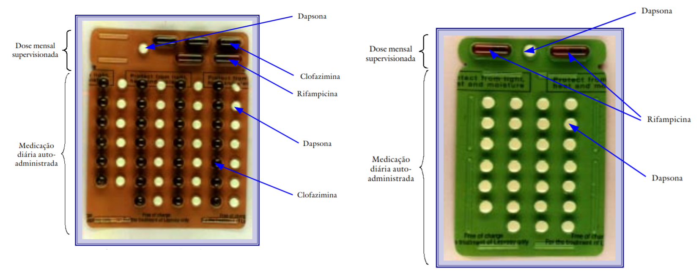

<style>
  p.caption {
   font-size: 0.6em;
  }
</style>
## Sumário

-  Hanseníase 
 
-  Modelos Epidemiológicos Matemáticos
 
-  Hanseníase: Um modelo Baseado em Agentes
 
-  Implementação
 
-  Resultados

-  Conclusão e Planos Futuros

-  Referências

```{r setup, include=FALSE}
xaringan::summon_remark()
options(htmltools.dir.version = FALSE)
library(plotly)
library(dplyr)
library(tidyr)
library(readr)
library(processx)
library(knitr)
```


---
class: inverse, center, middle

# Hanseníase

---
## Características 

-  A Hanseníase é causada pelo bacilo *Mycobacterium Leprae* 

-  É uma doença crônica e progressiva

-  Foi conhecida durantes séculos como Lepra

-  É dividida em casos Paucibacilares e Multibacilares

-  É transmitida por meio de gotículas de saliva eliminadas na fala, tosse ou espirro, de pessoas não tratadas

-  Indivíduos em tratamento deixam de transmitir a doença

---
## Sintomas

-  Lesões de pele, geralmente, tem uma pigmentação diferente da pele, podendo também ter aspectos achatados, elevados ou nodulos 

-  Os sintomas podem ocorrer dentro de 1 ano após o contágio

-  Alguns casos podem levar até 20 anos para os sintomas aparecer


```{r imagemMenino, out.width = "60%",echo=FALSE,fig.align='center',fig.cap='Figura 1: Progressão da Hanseíase em uma pessoa. Fonte: Biblioteca Virtual em saúde'}
include_graphics("Docs/hanseniase.jpg")
```

???
A pigmentação pode variar de uma pigmentação mais clara que a pele, até uma pigmentação avermelhada ou acobreada

---
## Estigmas Sociais

- Até a década de 1940 a hanseníase era dada como incurável

- Os portadores da Hanseníase torvavam-se desfigurados e/ou tinham deficiências significativas

- Os portadores da Hanseníase muitas vezes eram temidos pelo resto da sociedade, e por isso eram isolados e segregados do restante da população

- O estigma social em torno da hanseníase tem um alto impacto psicológico nas suas vítimas

---
## Tratamento e Prevenção

- A prevenção da Hanseníase se da na maior parte das vezes pela vacina BCG

- O tratamento é feito usando um coquetel de antibióticos adiministrado mensalmente de pelo tempo de tratamento

```{r out.width = "90%",echo=FALSE,fig.align='center',fig.cap='Figura 2: Cartela de antibióticos usadas no tratamento da hanseníase MB e PB respectivamente. Fonte: Guia para o Controle da Hanseníase'}

```
???
São 6 aplicações mensais do coquetel para o caso PB
e 12 aplicações mensais do coquetel para o caso MB
---
## Cenário Epidemiológico

- No ano 2000, a OMS publicou o *Guide to Eliminate Leprosy as a Public Health Problem*<sup>1</sup>

- Meta estipulada, de que, a prevalência da doença deveria ser menor que 1/10.000 habitantes, para que a hanseníase deixasse de ser um problema de saúde pública 

- Vários países, incluindo o Brasil, por diversas razões, não conseguiram cumprir essa meta

- Em 2019, foram reportados à OMS 202.185 casos novos da doença no mundo

- Em 2019, foram notificados 27.864 casos no Brasil

- Em 2018, a Região Norte foi responsavel por 31,95% dos novos casos de Hanseníase no Brasil, atrás apenas da Região Centro-Oeste com 41,29%
<span class="footnote"><sup>1</sup> Guia para Eliminar a Hanseníase como Problema de Saúde Pública - em tradução livre</span>

---
class: inverse, center, middle

# Modelos Epidemiológicos Matemáticos
