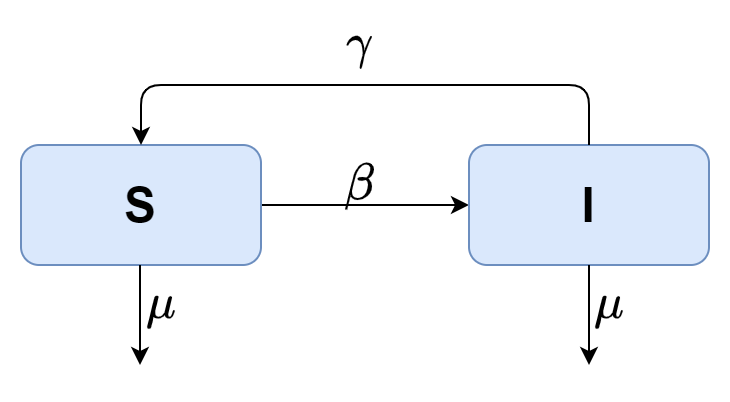
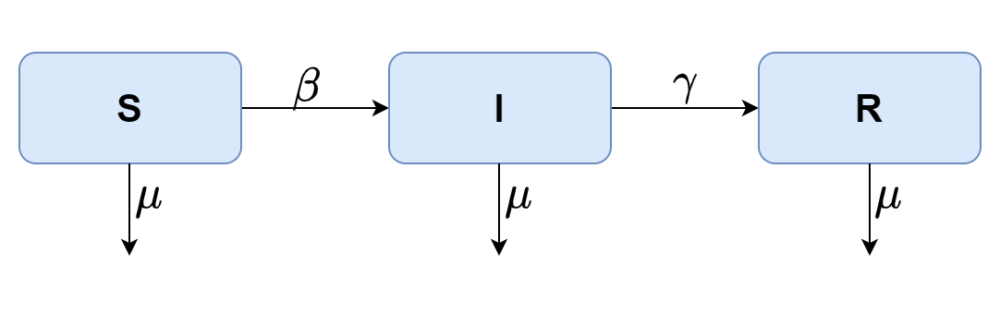

<style>
  p.caption {
   font-size: 0.6em;
  }
</style>
## Sumário

-  Hanseníase;
 
-  Modelos Epidemiológicos Matemáticos;
 
-  Hanseníase: Um modelo Baseado em Agentes;
 
-  Implementação;
 
-  Resultados;

-  Conclusão e Planos Futuros.


```{r setup, include=FALSE}
xaringan::summon_remark()
options(htmltools.dir.version = FALSE)
library(plotly)
library(dplyr)
library(tidyr)
library(readr)
library(processx)
library(knitr)
div <- 10.0489
```


---
class: inverse, center, middle

# Hanseníase

---
## Características 

-  A Hanseníase é causada pelo bacilo *Mycobacterium Leprae*;

-  É uma doença crônica e progressiva;

-  Foi conhecida durantes séculos como Lepra;

-  É dividida em casos Paucibacilares e Multibacilares;

-  É transmitida por meio de gotículas de saliva eliminadas na fala, tosse ou espirro, de pessoas não tratadas;

-  Indivíduos em tratamento deixam de transmitir a doença.

---
## Sintomas

-  Lesões de pele, geralmente, tem uma pigmentação diferente da pele, podendo também ter aspectos achatados, elevados ou nodulos;

-  Os sintomas podem ocorrer dentro de 1 ano após o contágio;

-  Alguns casos podem levar até 20 anos para os sintomas aparecer.


```{r imagemMenino, out.width = "70%",echo=FALSE,fig.align='center'}

```

???
A pigmentação pode variar de uma pigmentação mais clara que a pele, até uma pigmentação avermelhada ou acobreada

---
## Estigmas Sociais

- Até a década de 1940 a hanseníase era dada como incurável;

- Os portadores da Hanseníase torvavam-se desfigurados e/ou tinham deficiências significativas;

- Os portadores da Hanseníase muitas vezes eram temidos pelo resto da sociedade, e por isso eram isolados e segregados do restante da população;

- O estigma social em torno da hanseníase tem um alto impacto psicológico nas suas vítimas.

---
## Tratamento e Prevenção

- A prevenção da Hanseníase se da na maior parte das vezes pela vacina BCG;

- O tratamento é feito usando um coquetel de antibióticos adiministrado mensalmente de pelo tempo de tratamento.

```{r out.width = "100%",echo=FALSE,fig.align='center'}
include_graphics("Docs/cartela.png")
```
???
São 6 aplicações mensais do coquetel para o caso PB
e 12 aplicações mensais do coquetel para o caso MB
---
## Cenário Epidemiológico

- No ano 2000, a OMS publicou o *Guide to Eliminate Leprosy as a Public Health Problem*<sup>1</sup>;

- Meta estipulada, de que, a prevalência da doença deveria ser menor que 1/10.000 habitantes, para que a hanseníase deixasse de ser um problema de saúde pública;

- Vários países, incluindo o Brasil, por diversas razões, não conseguiram cumprir essa meta;

- Em 2019, foram reportados à OMS 202.185 casos novos da doença no mundo;

- Em 2019, foram notificados 27.864 casos no Brasil;

- Em 2018, a Região Norte foi responsavel por 31,95% dos novos casos de Hanseníase no Brasil, atrás apenas da Região Centro-Oeste com 41,29%.
<span class="footnote"><sup>1</sup> Guia para Eliminar a Hanseníase como Problema de Saúde Pública - em tradução livre</span>

---
class: inverse, center, middle

# Modelos Epidemiológicos Matemáticos

---
## Modelos Matemáticos

- O que é um Modelo?

--

- Por que usar um Modelo?

--

- Em que aréas a Modelagem Matemática é aplicada?

--

- Física, Química, Biologia, Economia, Epidemiologia, entre outras.

--

- O nosso foco nesse trabalho serão os Modelos Epidemiológicos;

--

- Nesses modelos ao contrario dos demais exemplos, não é possível confirmar a eficácia dos modelos com experimento, os experimentos geralmente são impossíveis e provavelmente seriam antiéticos.

---
## Modelos Epidemiológicos

- Qual será a gravidade da epidemia? 

- Qual o número total de pessoas infectadas que podem requerer cuidados médicos?

- Como saber o número máximo de pessoas infectadas em um determinado momento?

- Quanto tempo vai durar? Quando chegará ao seu pico? 

- Quarentena e/ou vacinação são eficazes para esta epidemia?

- Qual a quantidade de vacina, antibióticos ou antivirais serão necessários?

- Que medidas podemos tomar para conter, controlar ou até erradicar uma doença endêmica? 

---
## Modelo Susceptível-Infectado (SIS)

Considerando uma população de tamanho $N$, constante, temos $N=S(t)+I(t).$

As equações que regem o modelo são:

$$\begin{align}
    \frac{dS}{dt} &= - \beta S \textbf{I} + \lambda \textbf{I} + \mu (\textbf{N}-S)\\
    \frac{dI}{dt} &= - \beta S \textbf{I} - \lambda \textbf{I} - \mu \textbf{I}
\end{align}$$

```{r out.width = "50%",echo=FALSE,fig.align='center'}

```


---
## Modelo Susceptível-Infectado (SIR)

Considerando uma população de tamanho $N$, constante, temos $N = S(t) + I(t) + R(t)$.

As equações que regem o modelo são:

$$\begin{align}
    \frac{dS}{dt} &= - \beta S \textbf{I} + \mu (\textbf{N}-S)\\
    \frac{dI}{dt} &= \beta S \textbf{I} - \lambda \textbf{I} - \mu \textbf{I}\\
    \frac{dR}{dt} &= \lambda \textbf{I} - \mu \textbf{R}
\end{align}$$

```{r out.width = "55%",echo=FALSE,fig.align='center'}

```

---
## Modelo Susceptível-Infectado (SEIR)

Considerando uma população de tamanho $N$, constante, temos $N = S(t) + E(t) + I(t) + R(t)$.

As equações que regem o modelo são:
$$\begin{align}
    \frac{dS}{dt} &= \mu - \beta S I - \mu S,\\
    \frac{dE}{dt} &= \beta S I - (\mu + \kappa)E,\\
    \frac{dI}{dt} &= \kappa E - (\mu + \gamma)I,\\
    \frac{dR}{dt} &= \gamma I - \mu R,
\end{align}$$

```{r out.width = "55%",echo=FALSE,fig.align='center'}

```


---
## Modelagem Baseada em Agentes

- É uma técnica de modelagem em que uma coleção de "entidades" autônomas chamadas de agentes, dado um conjunto de regras, são capazes de tomar decisões;

- Os agentes podem exercer decisões simples, até mesmo decisões complexas como inteligências adaptativas;

- Nos modelos baseado em agentes, mesmo tratando os indivíduos como pertecentes a um determinado compartimento, cada um desses indivíduos, ou agentess podem ser completamente diferentes uns dos outros;

- Os agentes de um mesmo compartimento podem ter características que os diferem, tais como idade, sexo, propensão à adquirir determinada doença etc;

- A modelagem baseada em agentes é uma técnica robusta, tendo sua aplicação estendida além da modelagem do espalhamento de doenças como em modelos econômicos e, também, em diversas outras áreas da ciência.

---
class: inverse, center, middle

# Hanseníase: Um modelo Baseado em Agentes
---

## Esquema do Modelo

O modelo utilizado é um modelo compartimental baseado em agentes, sendo os compartimentos: $X$ indivíduos susceptíveis, $L_i$ indivíduos latente, $I_i$ indivíduos infecciosos, $T_i$ indivíduos em tratamento e $L_i (R)$ indivíduos latentes recuperados.

```{r out.width = "95%",echo=FALSE,fig.align='center'}

```

---
## Susceptível

- Os indivíduos susceptíveis tem uma probabilidade de serem contaminados, $P_{MB}$, para o tipo multibacilar, dada pela equação:
$$P_{MB} = (1-\epsilon_v)(1-{\beta_{MB}}^{N_{I_{MB}}})$$

- Os indivíduos susceptíveis também tem uma probabilidade de contagio, $P_{PB}$, para o tipo paucibacilar, que é dada pela equação:
$$P_{PB} = (1-\epsilon_v)(1-{\beta_{PB}}^{N_{I_{PB}}})$$

- Cada indivíduo susceptível tem 8 contatos por vizinhança. Além disso ele pode ter um contato aleatório em qualquer lugar da rede.

---
## Latente

- Os indivíduos no estado latente são hospedeiros do patógeno, porém, não apresentam sintomas e não transmitem a doença;

- O tempo de ativação do bacilo varia entre 3 a 4 anos;

- No modelo quando um idivíduo entra no estado latente ele recebe uma tempo de latência gerado aleatoriamente entre o tempo mínimo e máximo de latência;

- Após atingir esse tempo de latência ele progride para o estado infeccioso.

---
## Infeccioso

- Os indivíduos infecciosos são aqueles em que sofreram a ativação do bacilo;

- Esses indivíduos passam a apresentar sintomas e a transmitir a doença;

- Por estarem no estado ativo da doença, esses indivíduos estão sujeitos a um aumento na probabilidade de morrer, isto é, $\mu_I = 3,5\mu$, sendo $\mu$ a probabilidade de morte natural de um indivíduo;

- Indivíduos portadores de hanseníase do tipo paucibacilar tem uma probabilidade $1 \leq \alpha \leq 0$, de autocura;

- Um indivíduo infeccioso tem uma probabilidade $P_{treat}$ de entrar em tratamento, sendo $0 \leq P_{treat} \leq 1$;

- Os indivíduos infecciosos que passam na probabilidade de tratamento recebem um tempo de identificação aleatório, que varia entre 0 e o tempo máximo de identificação utilizado na simulação. 

---
## Tratamento

- Quando o tempo de identificação definido de um indivíduo infeccioso chega ao fim ele entra em tratamento;

- Indivíduos em tratamento param de transmitir a doença mesmo ainda tendo o patógeno;

- Indivíduos com hanseníase PB tem uma probabilidade, $\phi_{PB}$, de se recuperar após 6 meses de tratamento;

- Indivíduos com hanseníase MB tem uma probabilidade, $\phi_{MB}$, de se recuperar após 12 meses de tratamento;

- Caso o tratamento falhe, o indivíduo retorna ao compartimento dos infecciosos, voltando a transmitir a doença;

- Um método alternativo de tratamento é a aplicação da vacina BCG em crianças menores de 6 anos.

---
## Latente Recuperado

- Os indivíduos em que o tratamento foi bem sucedido, progridem para o estado latente recuperado;

- Esses indivíduos podem ter uma recaída para a classe infecciosa com probabilidades $\sigma_{PB}$ e $\sigma_{MB}$ para os tipos paucibacilar e multibacilar, respectivamente.

---
## Implementação

- Rede quadrada de tamanho linear $L = 317$ e um total de agentes dado por $N = L \times L = 100.489$;

- Cada agente tem um total de 8 vizinhos fixos mais a possibilidade de ter de 0 a 1 contato aleatorio a cada passo da simulação;

- Cada passo da simulação é equivalente a um dia, iniciando no primeiro dia e finalizando ao completar 300 anos.

```{r out.width = "46%",echo=FALSE,fig.align='center'}

```

---
## Implementação (Continuação)

- Em $t=0$, a rede é inicializada com todos os indivíduos como susceptível; 

- São distribuido aleatóriamente, 150 indivíduos lantente do tipo PB e 1 induvíduo latente do tipo MB;

- Do $t=0$ até $t=100~Anos$, sem qualquer tipo de tratamento para que a doença se desenvolva a na população;

- Após atingir a marca de $t=100~Anos$, serão aplicados os métodos de tratamento;

- Nos cenários simulados, a probabilidade de tratamento pode ser dada por $P_{treat} \in [0,25;~0,50;~0,75;~0,95]$ e a imunidade da BCG é dada por $\epsilon_v \in [0,00;~0,50;~0,99]$;

- A distribuição de idade é feita de forma aleatória porém com as probabilidades se adaptando aos dados demográficos.  

---
## Calibragem do Modelo

```{r calibragem, echo=FALSE,message=FALSE, fig.align='center'}
T0m <- read_csv("dados/data-02-02-2021/T025/it00m/v00/InfectiousPrevalence.csv")
T0m <- T0m[-seq(102,301),]
T0m <- T0m[-1,]
plot_ly( x=T0m$Time, y=T0m$TotalInfectious ,name = 'Prevalência Hanseníase',mode = 'lines',type = 'scatter' ,width = 810,height = 450) %>%
  layout(
    colorway = c('#1f77b4', '#ff7f0e', '#2ca02c', '#d62728', '#9467bd', '#8c564b'),
    title = list(text = '<b> Calibragem do parâmetro de infectividade </b>'),
    xaxis = list(title = '<b>Tempo (Anos)</b>', rangemode = 'tozero'),
    yaxis = list(title = '<b>Número de Indivíduos Infecciosos</b>', rangemode = 'tozero'),
    shapes = list(type = "rect",
                  fillcolor = "blue", line = list(color = "blue"), opacity = 0.2,
                  x0 = 0, x1 = 100, xref = "x",
                  y0 = 800, y1 = 1300, yref = "y")
  )

```

---
## Parâmetros do Modelo

Os parâmetros gerais utilizados nos modelos são:  
  
  
  

| Parâmetro     	| Descrição                             	| Valor                       	|
|---------------	|---------------------------------------	|-----------------------------	|
| $\beta_{MB}$  	| Infectividade do tipo MB              	| $1,73822168 \times 10^{-4}$ 	|
| $\beta_{PB}$  	| Infectividade do tipo PB              	| $0,5\times\beta_{MB}$         |
| $\alpha$      	| Probabilidade de autocura (PB)        	| $0,000614$                  	|
| $\phi_{PB}$   	| Probabilidade de cura (após 6 meses)  	| $0,974$                     	|
| $\phi_{MB}$   	| Probabilidade de cura (após 12 meses) 	| $0,953$                     	|
| $\sigma_{PB}$ 	| Probabilidade de recaída (PB)         	| $0,0037$                    	|
| $\sigma_{MB}$ 	| Probabilidade de recaída (MB)         	| $0,0011$                    	|

---
class: inverse, center, middle

# Resultados

---
### BCG $\epsilon_v = 0,00$
```{r ,BCG 00, echo=FALSE,message=FALSE,warning=FALSE}
T0m <- read_csv("dados/data-02-02-2021/T025/it00m/v00/InfectiousPrevalence.csv")
T0m <- T0m[-1,]
T3m <- read_csv("dados/data-02-02-2021/T025/it03m/v00/InfectiousPrevalence.csv")
T3m <- T3m[-1,]
T6m <- read_csv("dados/data-02-02-2021/T025/it06m/v00/InfectiousPrevalence.csv")
T6m <- T6m[-1,]
T12m <- read_csv("dados/data-02-02-2021/T025/it12m/v00/InfectiousPrevalence.csv")
T12m <- T12m[-1,]
T24m <- read_csv("dados/data-02-02-2021/T025/it24m/v00/InfectiousPrevalence.csv")
T24m <- T24m[-1,]
T36m <- read_csv("dados/data-02-02-2021/T025/it36m/v00/InfectiousPrevalence.csv")
T36m <- T36m[-1,]

PrevalenceV00T25 <- plot_ly( x=T0m$Time, y=T36m$TotalInfectious ,name = '36 Meses',mode = 'lines',type = 'scatter',legendgroup = 'T36m$Time') %>%
  add_trace(y= T24m$TotalInfectious, name = '24 Meses', mode = 'lines',legendgroup = 'T24m$Time') %>%
  add_trace(y= T12m$TotalInfectious, name = '12 Meses', mode = 'lines' ,legendgroup = 'T12m$Time') %>%
  add_trace(y= T6m$TotalInfectious, name = '6 Meses', mode = 'lines',legendgroup = 'T6m$Time') %>%
  add_trace(y= T3m$TotalInfectious, name = '3 Meses', mode = 'lines',legendgroup = 'T3m$Time') %>%
  add_trace(y= T0m$TotalInfectious, name = '0 Meses', mode = 'lines',legendgroup = 'T0m$Time') %>%
  layout(
    colorway = c('#1f77b4', '#ff7f0e', '#2ca02c', '#d62728', '#9467bd', '#8c564b'),
    legend = list(title=list(text='<b> Tempo de Identificação </b>'),bgcolor="#E2E2E2"),
    xaxis = list(title = 'Tempo (Anos)', rangemode = 'tozero'),
    yaxis = list(title = 'Indivíduos Infecciosos ', rangemode = 'tozero'),
    shapes = list(type = "rect",
                  fillcolor = "blue", line = list(color = "blue"), opacity = 0.2,
                  x0 = 0, x1 = 300, xref = "x",
                  y0 = 800, y1 = 1300, yref = "y")
  )

#LeprosyPrevalence Vaccine0 T050
T0m <- read_csv("dados/data-02-02-2021/T050/it00m/v00/InfectiousPrevalence.csv")
T0m <- T0m[-1,]
T3m <- read_csv("dados/data-02-02-2021/T050/it03m/v00/InfectiousPrevalence.csv")
T3m <- T3m[-1,]
T6m <- read_csv("dados/data-02-02-2021/T050/it06m/v00/InfectiousPrevalence.csv")
T6m <- T6m[-1,]
T12m <- read_csv("dados/data-02-02-2021/T050/it12m/v00/InfectiousPrevalence.csv")
T12m <- T12m[-1,]
T24m <- read_csv("dados/data-02-02-2021/T050/it24m/v00/InfectiousPrevalence.csv")
T24m <- T24m[-1,]
T36m <- read_csv("dados/data-02-02-2021/T050/it36m/v00/InfectiousPrevalence.csv")
T36m <- T36m[-1,]

PrevalenceV00T50 <- plot_ly( x=T0m$Time, y=T36m$TotalInfectious ,name = '36 Meses',mode = 'lines',type = 'scatter' ,showlegend = F,legendgroup = 'T36m$Time') %>%
  add_trace(y= T24m$TotalInfectious, name = '24 Meses', mode = 'lines',showlegend = F,legendgroup = 'T24m$Time') %>%
  add_trace(y= T12m$TotalInfectious, name = '12 Meses', mode = 'lines',showlegend = F,legendgroup = 'T12m$Time') %>%
  add_trace(y= T6m$TotalInfectious, name = '6 Meses', mode = 'lines',showlegend = F,legendgroup = 'T6m$Time') %>%
  add_trace(y= T3m$TotalInfectious, name = '3 Meses', mode = 'lines',showlegend = F,legendgroup = 'T3m$Time') %>%
  add_trace(y= T0m$TotalInfectious, name = '0 Meses', mode = 'lines',showlegend = F,legendgroup = 'T0m$Time') %>%
  layout(
    colorway = c('#1f77b4', '#ff7f0e', '#2ca02c', '#d62728', '#9467bd', '#8c564b'),
    legend = list(title=list(text='<b> Tempo de Identificação </b>'),bgcolor="#E2E2E2"),
    xaxis = list(title = 'Tempo (Anos)', rangemode = 'tozero'),
    yaxis = list(title = 'Indivíduos Infecciosos ', rangemode = 'tozero'),
    shapes = list(type = "rect",
                  fillcolor = "blue", line = list(color = "blue"), opacity = 0.2,
                  x0 = 0, x1 = 300, xref = "x",
                  y0 = 800, y1 = 1300, yref = "y")
  )


T0m <- read_csv("dados/data-02-02-2021/T075/it00m/v00/InfectiousPrevalence.csv")
T0m <- T0m[-1,]
T3m <- read_csv("dados/data-02-02-2021/T075/it03m/v00/InfectiousPrevalence.csv")
T3m <- T3m[-1,]
T6m <- read_csv("dados/data-02-02-2021/T075/it06m/v00/InfectiousPrevalence.csv")
T6m <- T6m[-1,]
T12m <- read_csv("dados/data-02-02-2021/T075/it12m/v00/InfectiousPrevalence.csv")
T12m <- T12m[-1,]
T24m <- read_csv("dados/data-02-02-2021/T075/it24m/v00/InfectiousPrevalence.csv")
T24m <- T24m[-1,]
T36m <- read_csv("dados/data-02-02-2021/T075/it36m/v00/InfectiousPrevalence.csv")
T36m <- T36m[-1,]

PrevalenceV00T75 <- plot_ly( x=T0m$Time, y=T36m$TotalInfectious ,name = '36 Meses',mode = 'lines',type = 'scatter' ,showlegend = F,legendgroup = 'T36m$Time') %>%
  add_trace(y= T24m$TotalInfectious, name = '24 Meses', mode = 'lines',showlegend = F,legendgroup = 'T24m$Time') %>%
  add_trace(y= T12m$TotalInfectious, name = '12 Meses', mode = 'lines',showlegend = F,legendgroup = 'T12m$Time') %>%
  add_trace(y= T6m$TotalInfectious, name = '6 Meses', mode = 'lines',showlegend = F,legendgroup = 'T6m$Time') %>%
  add_trace(y= T3m$TotalInfectious, name = '3 Meses', mode = 'lines',showlegend = F,legendgroup = 'T3m$Time') %>%
  add_trace(y= T0m$TotalInfectious, name = '0 Meses', mode = 'lines',showlegend = F,legendgroup = 'T0m$Time') %>%
  layout(
    colorway = c('#1f77b4', '#ff7f0e', '#2ca02c', '#d62728', '#9467bd', '#8c564b'),
    legend = list(title=list(text='<b> Tempo de Identificação </b>'),bgcolor="#E2E2E2"),
    xaxis = list(title = 'Tempo (Anos)', rangemode = 'tozero'),
    yaxis = list(title = 'Indivíduos Infecciosos ', rangemode = 'tozero'),
    shapes = list(type = "rect",
                  fillcolor = "blue", line = list(color = "blue"), opacity = 0.2,
                  x0 = 0, x1 = 300, xref = "x",
                  y0 = 800, y1 = 1300, yref = "y")
  )

T0m <- read_csv("dados/data-02-02-2021/T095/it00m/v00/InfectiousPrevalence.csv")
T0m <- T0m[-1,]
T3m <- read_csv("dados/data-02-02-2021/T095/it03m/v00/InfectiousPrevalence.csv")
T3m <- T3m[-1,]
T6m <- read_csv("dados/data-02-02-2021/T095/it06m/v00/InfectiousPrevalence.csv")
T6m <- T6m[-1,]
T12m <- read_csv("dados/data-02-02-2021/T095/it12m/v00/InfectiousPrevalence.csv")
T12m <- T12m[-1,]
T24m <- read_csv("dados/data-02-02-2021/T095/it24m/v00/InfectiousPrevalence.csv")
T24m <- T24m[-1,]
T36m <- read_csv("dados/data-02-02-2021/T095/it36m/v00/InfectiousPrevalence.csv")
T36m <- T36m[-1,]

PrevalenceV00T95 <- plot_ly( x=T0m$Time, y=T36m$TotalInfectious ,name = '36 Meses',mode = 'lines',type = 'scatter' ,showlegend = F,legendgroup = 'T36m$Time') %>%
  add_trace(y= T24m$TotalInfectious, name = '24 Meses', mode = 'lines',showlegend = F,legendgroup = 'T24m$Time') %>%
  add_trace(y= T12m$TotalInfectious, name = '12 Meses', mode = 'lines',showlegend = F,legendgroup = 'T12m$Time') %>%
  add_trace(y= T6m$TotalInfectious, name = '6 Meses', mode = 'lines',showlegend = F,legendgroup = 'T6m$Time') %>%
  add_trace(y= T3m$TotalInfectious, name = '3 Meses', mode = 'lines',showlegend = F,legendgroup = 'T3m$Time') %>%
  add_trace(y= T0m$TotalInfectious, name = '0 Meses', mode = 'lines',showlegend = F,legendgroup = 'T0m$Time') %>%
  layout(
    colorway = c('#1f77b4', '#ff7f0e', '#2ca02c', '#d62728', '#9467bd', '#8c564b'),
    legend = list(title=list(text='<b> Tempo de Identificação </b>'),bgcolor="#E2E2E2"),
    xaxis = list(title = 'Tempo (Anos)', rangemode = 'tozero'),
    yaxis = list(title = 'Indivíduos Infecciosos ', rangemode = 'tozero'),
    shapes = list(type = "rect",
                  fillcolor = "blue", line = list(color = "blue"), opacity = 0.2,
                  x0 = 0, x1 = 300, xref = "x",
                  y0 = 800, y1 = 1300, yref = "y")
  )

Vaccine0 <- subplot(PrevalenceV00T25,PrevalenceV00T50,PrevalenceV00T75,PrevalenceV00T95,margin = c(0.05,0.05,0.08,0.08),nrows = 2,titleY = T,titleX = T,shareY = F,shareX = F)
Vaccine0 <- Vaccine0 %>% layout(autosize = F,
  width = 810,
  annotations = list(
  list(x = -0.05 , y = 0.55, text = "(a)", showarrow = F, xref='paper', yref='paper',xanchor = 'left'),
  list(x = -0.05 , y = -0.05, text = "(c)", showarrow = F, xref='paper', yref='paper',xanchor = 'left'),
  list(x = 0.489 , y = 0.55, text = "(b)", showarrow = F, xref='paper', yref='paper',xanchor = 'left'),
  list(x = 0.489 , y = -0.05, text = "(d)", showarrow = F, xref='paper', yref='paper',xanchor = 'left'))
) 

Vaccine0
```

---
### BCG $\epsilon_v = 0,50$

```{r ,BCG 50, echo=FALSE,message=FALSE,warning=FALSE}
T0m <- read_csv("dados/data-02-02-2021/T025/it00m/v50/InfectiousPrevalence.csv")
T0m <- T0m[-1,]
T3m <- read_csv("dados/data-02-02-2021/T025/it03m/v50/InfectiousPrevalence.csv")
T3m <- T3m[-1,]
T6m <- read_csv("dados/data-02-02-2021/T025/it06m/v50/InfectiousPrevalence.csv")
T6m <- T6m[-1,]
T12m <- read_csv("dados/data-02-02-2021/T025/it12m/v50/InfectiousPrevalence.csv")
T12m <- T12m[-1,]
T24m <- read_csv("dados/data-02-02-2021/T025/it24m/v50/InfectiousPrevalence.csv")
T24m <- T24m[-1,]
T36m <- read_csv("dados/data-02-02-2021/T025/it36m/v50/InfectiousPrevalence.csv")
T36m <- T36m[-1,]

PrevalenceV00T25 <- plot_ly( x=T0m$Time, y=T36m$TotalInfectious ,name = '36 Meses',mode = 'lines',type = 'scatter',legendgroup = 'T36m$Time') %>%
  add_trace(y= T24m$TotalInfectious, name = '24 Meses', mode = 'lines',legendgroup = 'T24m$Time') %>%
  add_trace(y= T12m$TotalInfectious, name = '12 Meses', mode = 'lines' ,legendgroup = 'T12m$Time') %>%
  add_trace(y= T6m$TotalInfectious, name = '6 Meses', mode = 'lines',legendgroup = 'T6m$Time') %>%
  add_trace(y= T3m$TotalInfectious, name = '3 Meses', mode = 'lines',legendgroup = 'T3m$Time') %>%
  add_trace(y= T0m$TotalInfectious, name = '0 Meses', mode = 'lines',legendgroup = 'T0m$Time') %>%
  layout(
    colorway = c('#1f77b4', '#ff7f0e', '#2ca02c', '#d62728', '#9467bd', '#8c564b'),
    legend = list(title=list(text='<b> Tempo de Identificação </b>'),bgcolor="#E2E2E2"),
    xaxis = list(title = 'Tempo (Anos)', rangemode = 'tozero'),
    yaxis = list(title = 'Indivíduos Infecciosos ', rangemode = 'tozero'),
    shapes = list(type = "rect",
                  fillcolor = "blue", line = list(color = "blue"), opacity = 0.2,
                  x0 = 0, x1 = 300, xref = "x",
                  y0 = 800, y1 = 1300, yref = "y")
  )

#LeprosyPrevalence Vaccine0 T050
T0m <- read_csv("dados/data-02-02-2021/T050/it00m/v50/InfectiousPrevalence.csv")
T0m <- T0m[-1,]
T3m <- read_csv("dados/data-02-02-2021/T050/it03m/v50/InfectiousPrevalence.csv")
T3m <- T3m[-1,]
T6m <- read_csv("dados/data-02-02-2021/T050/it06m/v50/InfectiousPrevalence.csv")
T6m <- T6m[-1,]
T12m <- read_csv("dados/data-02-02-2021/T050/it12m/v50/InfectiousPrevalence.csv")
T12m <- T12m[-1,]
T24m <- read_csv("dados/data-02-02-2021/T050/it24m/v50/InfectiousPrevalence.csv")
T24m <- T24m[-1,]
T36m <- read_csv("dados/data-02-02-2021/T050/it36m/v50/InfectiousPrevalence.csv")
T36m <- T36m[-1,]

PrevalenceV00T50 <- plot_ly( x=T0m$Time, y=T36m$TotalInfectious ,name = '36 Meses',mode = 'lines',type = 'scatter' ,showlegend = F,legendgroup = 'T36m$Time') %>%
  add_trace(y= T24m$TotalInfectious, name = '24 Meses', mode = 'lines',showlegend = F,legendgroup = 'T24m$Time') %>%
  add_trace(y= T12m$TotalInfectious, name = '12 Meses', mode = 'lines',showlegend = F,legendgroup = 'T12m$Time') %>%
  add_trace(y= T6m$TotalInfectious, name = '6 Meses', mode = 'lines',showlegend = F,legendgroup = 'T6m$Time') %>%
  add_trace(y= T3m$TotalInfectious, name = '3 Meses', mode = 'lines',showlegend = F,legendgroup = 'T3m$Time') %>%
  add_trace(y= T0m$TotalInfectious, name = '0 Meses', mode = 'lines',showlegend = F,legendgroup = 'T0m$Time') %>%
  layout(
    colorway = c('#1f77b4', '#ff7f0e', '#2ca02c', '#d62728', '#9467bd', '#8c564b'),
    legend = list(title=list(text='<b> Tempo de Identificação </b>'),bgcolor="#E2E2E2"),
    xaxis = list(title = 'Tempo (Anos)', rangemode = 'tozero'),
    yaxis = list(title = 'Indivíduos Infecciosos ', rangemode = 'tozero'),
    shapes = list(type = "rect",
                  fillcolor = "blue", line = list(color = "blue"), opacity = 0.2,
                  x0 = 0, x1 = 300, xref = "x",
                  y0 = 800, y1 = 1300, yref = "y")
  )


T0m <- read_csv("dados/data-02-02-2021/T075/it00m/v50/InfectiousPrevalence.csv")
T0m <- T0m[-1,]
T3m <- read_csv("dados/data-02-02-2021/T075/it03m/v50/InfectiousPrevalence.csv")
T3m <- T3m[-1,]
T6m <- read_csv("dados/data-02-02-2021/T075/it06m/v50/InfectiousPrevalence.csv")
T6m <- T6m[-1,]
T12m <- read_csv("dados/data-02-02-2021/T075/it12m/v50/InfectiousPrevalence.csv")
T12m <- T12m[-1,]
T24m <- read_csv("dados/data-02-02-2021/T075/it24m/v50/InfectiousPrevalence.csv")
T24m <- T24m[-1,]
T36m <- read_csv("dados/data-02-02-2021/T075/it36m/v50/InfectiousPrevalence.csv")
T36m <- T36m[-1,]

PrevalenceV00T75 <- plot_ly( x=T0m$Time, y=T36m$TotalInfectious ,name = '36 Meses',mode = 'lines',type = 'scatter' ,showlegend = F,legendgroup = 'T36m$Time') %>%
  add_trace(y= T24m$TotalInfectious, name = '24 Meses', mode = 'lines',showlegend = F,legendgroup = 'T24m$Time') %>%
  add_trace(y= T12m$TotalInfectious, name = '12 Meses', mode = 'lines',showlegend = F,legendgroup = 'T12m$Time') %>%
  add_trace(y= T6m$TotalInfectious, name = '6 Meses', mode = 'lines',showlegend = F,legendgroup = 'T6m$Time') %>%
  add_trace(y= T3m$TotalInfectious, name = '3 Meses', mode = 'lines',showlegend = F,legendgroup = 'T3m$Time') %>%
  add_trace(y= T0m$TotalInfectious, name = '0 Meses', mode = 'lines',showlegend = F,legendgroup = 'T0m$Time') %>%
  layout(
    colorway = c('#1f77b4', '#ff7f0e', '#2ca02c', '#d62728', '#9467bd', '#8c564b'),
    legend = list(title=list(text='<b> Tempo de Identificação </b>'),bgcolor="#E2E2E2"),
    xaxis = list(title = 'Tempo (Anos)', rangemode = 'tozero'),
    yaxis = list(title = 'Indivíduos Infecciosos ', rangemode = 'tozero'),
    shapes = list(type = "rect",
                  fillcolor = "blue", line = list(color = "blue"), opacity = 0.2,
                  x0 = 0, x1 = 300, xref = "x",
                  y0 = 800, y1 = 1300, yref = "y")
  )

T0m <- read_csv("dados/data-02-02-2021/T095/it00m/v50/InfectiousPrevalence.csv")
T0m <- T0m[-1,]
T3m <- read_csv("dados/data-02-02-2021/T095/it03m/v50/InfectiousPrevalence.csv")
T3m <- T3m[-1,]
T6m <- read_csv("dados/data-02-02-2021/T095/it06m/v50/InfectiousPrevalence.csv")
T6m <- T6m[-1,]
T12m <- read_csv("dados/data-02-02-2021/T095/it12m/v50/InfectiousPrevalence.csv")
T12m <- T12m[-1,]
T24m <- read_csv("dados/data-02-02-2021/T095/it24m/v50/InfectiousPrevalence.csv")
T24m <- T24m[-1,]
T36m <- read_csv("dados/data-02-02-2021/T095/it36m/v50/InfectiousPrevalence.csv")
T36m <- T36m[-1,]

PrevalenceV00T95 <- plot_ly( x=T0m$Time, y=T36m$TotalInfectious ,name = '36 Meses',mode = 'lines',type = 'scatter' ,showlegend = F,legendgroup = 'T36m$Time') %>%
  add_trace(y= T24m$TotalInfectious, name = '24 Meses', mode = 'lines',showlegend = F,legendgroup = 'T24m$Time') %>%
  add_trace(y= T12m$TotalInfectious, name = '12 Meses', mode = 'lines',showlegend = F,legendgroup = 'T12m$Time') %>%
  add_trace(y= T6m$TotalInfectious, name = '6 Meses', mode = 'lines',showlegend = F,legendgroup = 'T6m$Time') %>%
  add_trace(y= T3m$TotalInfectious, name = '3 Meses', mode = 'lines',showlegend = F,legendgroup = 'T3m$Time') %>%
  add_trace(y= T0m$TotalInfectious, name = '0 Meses', mode = 'lines',showlegend = F,legendgroup = 'T0m$Time') %>%
  layout(
    colorway = c('#1f77b4', '#ff7f0e', '#2ca02c', '#d62728', '#9467bd', '#8c564b'),
    legend = list(title=list(text='<b> Tempo de Identificação </b>'),bgcolor="#E2E2E2"),
    xaxis = list(title = 'Tempo (Anos)', rangemode = 'tozero'),
    yaxis = list(title = 'Indivíduos Infecciosos ', rangemode = 'tozero'),
    shapes = list(type = "rect",
                  fillcolor = "blue", line = list(color = "blue"), opacity = 0.2,
                  x0 = 0, x1 = 300, xref = "x",
                  y0 = 800, y1 = 1300, yref = "y")
  )

Vaccine0 <- subplot(PrevalenceV00T25,PrevalenceV00T50,PrevalenceV00T75,PrevalenceV00T95,margin = c(0.05,0.05,0.08,0.08),nrows = 2,titleY = T,titleX = T,shareY = F,shareX = F)
Vaccine0 <- Vaccine0 %>% layout(autosize = F,
  width = 810,
  annotations = list(
  list(x = -0.05 , y = 0.55, text = "(a)", showarrow = F, xref='paper', yref='paper',xanchor = 'left'),
  list(x = -0.05 , y = -0.05, text = "(c)", showarrow = F, xref='paper', yref='paper',xanchor = 'left'),
  list(x = 0.489 , y = 0.55, text = "(b)", showarrow = F, xref='paper', yref='paper',xanchor = 'left'),
  list(x = 0.489 , y = -0.05, text = "(d)", showarrow = F, xref='paper', yref='paper',xanchor = 'left'))
) 

Vaccine0
```

---
### BCG $\epsilon_v = 0,99$

```{r ,BCG 99, echo=FALSE,message=FALSE,warning=FALSE}
T0m <- read_csv("dados/data-02-02-2021/T025/it00m/v99/InfectiousPrevalence.csv")
T0m <- T0m[-1,]
T3m <- read_csv("dados/data-02-02-2021/T025/it03m/v99/InfectiousPrevalence.csv")
T3m <- T3m[-1,]
T6m <- read_csv("dados/data-02-02-2021/T025/it06m/v99/InfectiousPrevalence.csv")
T6m <- T6m[-1,]
T12m <- read_csv("dados/data-02-02-2021/T025/it12m/v99/InfectiousPrevalence.csv")
T12m <- T12m[-1,]
T24m <- read_csv("dados/data-02-02-2021/T025/it24m/v99/InfectiousPrevalence.csv")
T24m <- T24m[-1,]
T36m <- read_csv("dados/data-02-02-2021/T025/it36m/v99/InfectiousPrevalence.csv")
T36m <- T36m[-1,]

PrevalenceV00T25 <- plot_ly( x=T0m$Time, y=T36m$TotalInfectious ,name = '36 Meses',mode = 'lines',type = 'scatter',legendgroup = 'T36m$Time') %>%
  add_trace(y= T24m$TotalInfectious, name = '24 Meses', mode = 'lines',legendgroup = 'T24m$Time') %>%
  add_trace(y= T12m$TotalInfectious, name = '12 Meses', mode = 'lines' ,legendgroup = 'T12m$Time') %>%
  add_trace(y= T6m$TotalInfectious, name = '6 Meses', mode = 'lines',legendgroup = 'T6m$Time') %>%
  add_trace(y= T3m$TotalInfectious, name = '3 Meses', mode = 'lines',legendgroup = 'T3m$Time') %>%
  add_trace(y= T0m$TotalInfectious, name = '0 Meses', mode = 'lines',legendgroup = 'T0m$Time') %>%
  layout(
    colorway = c('#1f77b4', '#ff7f0e', '#2ca02c', '#d62728', '#9467bd', '#8c564b'),
    legend = list(title=list(text='<b> Tempo de Identificação </b>'),bgcolor="#E2E2E2"),
    xaxis = list(title = 'Tempo (Anos)', rangemode = 'tozero'),
    yaxis = list(title = 'Indivíduos Infecciosos ', rangemode = 'tozero'),
    shapes = list(type = "rect",
                  fillcolor = "blue", line = list(color = "blue"), opacity = 0.2,
                  x0 = 0, x1 = 300, xref = "x",
                  y0 = 800, y1 = 1300, yref = "y")
  )

#LeprosyPrevalence Vaccine0 T050
T0m <- read_csv("dados/data-02-02-2021/T050/it00m/v99/InfectiousPrevalence.csv")
T0m <- T0m[-1,]
T3m <- read_csv("dados/data-02-02-2021/T050/it03m/v99/InfectiousPrevalence.csv")
T3m <- T3m[-1,]
T6m <- read_csv("dados/data-02-02-2021/T050/it06m/v99/InfectiousPrevalence.csv")
T6m <- T6m[-1,]
T12m <- read_csv("dados/data-02-02-2021/T050/it12m/v99/InfectiousPrevalence.csv")
T12m <- T12m[-1,]
T24m <- read_csv("dados/data-02-02-2021/T050/it24m/v99/InfectiousPrevalence.csv")
T24m <- T24m[-1,]
T36m <- read_csv("dados/data-02-02-2021/T050/it36m/v99/InfectiousPrevalence.csv")
T36m <- T36m[-1,]

PrevalenceV00T50 <- plot_ly( x=T0m$Time, y=T36m$TotalInfectious ,name = '36 Meses',mode = 'lines',type = 'scatter' ,showlegend = F,legendgroup = 'T36m$Time') %>%
  add_trace(y= T24m$TotalInfectious, name = '24 Meses', mode = 'lines',showlegend = F,legendgroup = 'T24m$Time') %>%
  add_trace(y= T12m$TotalInfectious, name = '12 Meses', mode = 'lines',showlegend = F,legendgroup = 'T12m$Time') %>%
  add_trace(y= T6m$TotalInfectious, name = '6 Meses', mode = 'lines',showlegend = F,legendgroup = 'T6m$Time') %>%
  add_trace(y= T3m$TotalInfectious, name = '3 Meses', mode = 'lines',showlegend = F,legendgroup = 'T3m$Time') %>%
  add_trace(y= T0m$TotalInfectious, name = '0 Meses', mode = 'lines',showlegend = F,legendgroup = 'T0m$Time') %>%
  layout(
    colorway = c('#1f77b4', '#ff7f0e', '#2ca02c', '#d62728', '#9467bd', '#8c564b'),
    legend = list(title=list(text='<b> Tempo de Identificação </b>'),bgcolor="#E2E2E2"),
    xaxis = list(title = 'Tempo (Anos)', rangemode = 'tozero'),
    yaxis = list(title = 'Indivíduos Infecciosos ', rangemode = 'tozero'),
    shapes = list(type = "rect",
                  fillcolor = "blue", line = list(color = "blue"), opacity = 0.2,
                  x0 = 0, x1 = 300, xref = "x",
                  y0 = 800, y1 = 1300, yref = "y")
  )


T0m <- read_csv("dados/data-02-02-2021/T075/it00m/v99/InfectiousPrevalence.csv")
T0m <- T0m[-1,]
T3m <- read_csv("dados/data-02-02-2021/T075/it03m/v99/InfectiousPrevalence.csv")
T3m <- T3m[-1,]
T6m <- read_csv("dados/data-02-02-2021/T075/it06m/v99/InfectiousPrevalence.csv")
T6m <- T6m[-1,]
T12m <- read_csv("dados/data-02-02-2021/T075/it12m/v99/InfectiousPrevalence.csv")
T12m <- T12m[-1,]
T24m <- read_csv("dados/data-02-02-2021/T075/it24m/v99/InfectiousPrevalence.csv")
T24m <- T24m[-1,]
T36m <- read_csv("dados/data-02-02-2021/T075/it36m/v99/InfectiousPrevalence.csv")
T36m <- T36m[-1,]

PrevalenceV00T75 <- plot_ly( x=T0m$Time, y=T36m$TotalInfectious ,name = '36 Meses',mode = 'lines',type = 'scatter' ,showlegend = F,legendgroup = 'T36m$Time') %>%
  add_trace(y= T24m$TotalInfectious, name = '24 Meses', mode = 'lines',showlegend = F,legendgroup = 'T24m$Time') %>%
  add_trace(y= T12m$TotalInfectious, name = '12 Meses', mode = 'lines',showlegend = F,legendgroup = 'T12m$Time') %>%
  add_trace(y= T6m$TotalInfectious, name = '6 Meses', mode = 'lines',showlegend = F,legendgroup = 'T6m$Time') %>%
  add_trace(y= T3m$TotalInfectious, name = '3 Meses', mode = 'lines',showlegend = F,legendgroup = 'T3m$Time') %>%
  add_trace(y= T0m$TotalInfectious, name = '0 Meses', mode = 'lines',showlegend = F,legendgroup = 'T0m$Time') %>%
  layout(
    colorway = c('#1f77b4', '#ff7f0e', '#2ca02c', '#d62728', '#9467bd', '#8c564b'),
    legend = list(title=list(text='<b> Tempo de Identificação </b>'),bgcolor="#E2E2E2"),
    xaxis = list(title = 'Tempo (Anos)', rangemode = 'tozero'),
    yaxis = list(title = 'Indivíduos Infecciosos ', rangemode = 'tozero'),
    shapes = list(type = "rect",
                  fillcolor = "blue", line = list(color = "blue"), opacity = 0.2,
                  x0 = 0, x1 = 300, xref = "x",
                  y0 = 800, y1 = 1300, yref = "y")
  )

T0m <- read_csv("dados/data-02-02-2021/T095/it00m/v99/InfectiousPrevalence.csv")
T0m <- T0m[-1,]
T3m <- read_csv("dados/data-02-02-2021/T095/it03m/v99/InfectiousPrevalence.csv")
T3m <- T3m[-1,]
T6m <- read_csv("dados/data-02-02-2021/T095/it06m/v99/InfectiousPrevalence.csv")
T6m <- T6m[-1,]
T12m <- read_csv("dados/data-02-02-2021/T095/it12m/v99/InfectiousPrevalence.csv")
T12m <- T12m[-1,]
T24m <- read_csv("dados/data-02-02-2021/T095/it24m/v99/InfectiousPrevalence.csv")
T24m <- T24m[-1,]
T36m <- read_csv("dados/data-02-02-2021/T095/it36m/v99/InfectiousPrevalence.csv")
T36m <- T36m[-1,]

PrevalenceV00T95 <- plot_ly( x=T0m$Time, y=T36m$TotalInfectious ,name = '36 Meses',mode = 'lines',type = 'scatter' ,showlegend = F,legendgroup = 'T36m$Time') %>%
  add_trace(y= T24m$TotalInfectious, name = '24 Meses', mode = 'lines',showlegend = F,legendgroup = 'T24m$Time') %>%
  add_trace(y= T12m$TotalInfectious, name = '12 Meses', mode = 'lines',showlegend = F,legendgroup = 'T12m$Time') %>%
  add_trace(y= T6m$TotalInfectious, name = '6 Meses', mode = 'lines',showlegend = F,legendgroup = 'T6m$Time') %>%
  add_trace(y= T3m$TotalInfectious, name = '3 Meses', mode = 'lines',showlegend = F,legendgroup = 'T3m$Time') %>%
  add_trace(y= T0m$TotalInfectious, name = '0 Meses', mode = 'lines',showlegend = F,legendgroup = 'T0m$Time') %>%
  layout(
    colorway = c('#1f77b4', '#ff7f0e', '#2ca02c', '#d62728', '#9467bd', '#8c564b'),
    legend = list(title=list(text='<b> Tempo de Identificação </b>'),bgcolor="#E2E2E2"),
    xaxis = list(title = 'Tempo (Anos)', rangemode = 'tozero'),
    yaxis = list(title = 'Indivíduos Infecciosos ', rangemode = 'tozero'),
    shapes = list(type = "rect",
                  fillcolor = "blue", line = list(color = "blue"), opacity = 0.2,
                  x0 = 0, x1 = 300, xref = "x",
                  y0 = 800, y1 = 1300, yref = "y")
  )

Vaccine0 <- subplot(PrevalenceV00T25,PrevalenceV00T50,PrevalenceV00T75,PrevalenceV00T95,margin = c(0.05,0.05,0.08,0.08),nrows = 2,titleY = T,titleX = T,shareY = F,shareX = F)
Vaccine0 <- Vaccine0 %>% layout(autosize = F,
  width = 810,
  annotations = list(
  list(x = -0.05 , y = 0.55, text = "(a)", showarrow = F, xref='paper', yref='paper',xanchor = 'left'),
  list(x = -0.05 , y = -0.05, text = "(c)", showarrow = F, xref='paper', yref='paper',xanchor = 'left'),
  list(x = 0.489 , y = 0.55, text = "(b)", showarrow = F, xref='paper', yref='paper',xanchor = 'left'),
  list(x = 0.489 , y = -0.05, text = "(d)", showarrow = F, xref='paper', yref='paper',xanchor = 'left'))
) 

Vaccine0
```

---
### Hanseníase Prevalência  - $\epsilon_v = 0,00$ , $P_{treat} = 0,75$

```{r ,who 00 75, echo=FALSE,message=FALSE,warning=FALSE}
T0m <- read_csv("dados/data-02-02-2021/T075/it00m/v00/InfectiousPrevalence.csv")
T0m <- T0m[-1,]
T3m <- read_csv("dados/data-02-02-2021/T075/it03m/v00/InfectiousPrevalence.csv")
T3m <- T3m[-1,]
T6m <- read_csv("dados/data-02-02-2021/T075/it06m/v00/InfectiousPrevalence.csv")
T6m <- T6m[-1,]
T12m <- read_csv("dados/data-02-02-2021/T075/it12m/v00/InfectiousPrevalence.csv")
T12m <- T12m[-1,]
T24m <- read_csv("dados/data-02-02-2021/T075/it24m/v00/InfectiousPrevalence.csv")
T24m <- T24m[-1,]
T36m <- read_csv("dados/data-02-02-2021/T075/it36m/v00/InfectiousPrevalence.csv")
T36m <- T36m[-1,]

plot_ly( x=T0m$Time, y=T0m$ TotalInfectious/div ,name = '0 Meses',mode = 'lines',type = 'scatter',width = 810,height = 450) %>%
  add_trace(y= T3m$ TotalInfectious/div, name = '3 Meses', mode = 'lines') %>%
  add_trace(y= T6m$ TotalInfectious/div, name = '6 Meses', mode = 'lines') %>%
  add_trace(y= T12m$ TotalInfectious/div, name = '12 Meses', mode = 'lines') %>%
  add_trace(y= T24m$ TotalInfectious/div, name = '24 Meses', mode = 'lines') %>%
  add_trace(y= T36m$ TotalInfectious/div, name = '36 Meses', mode = 'lines') %>%
  layout( colorway = c('#1f77b4', '#ff7f0e', '#2ca02c', '#d62728', '#9467bd', '#8c564b'),        
          legend = list(x=0.8,y=0.95, title=list(text='<b> Tempo de Identificação </b>'),bgcolor="#E2E2E2"),
          xaxis = list(range = c(100, 300),title = 'Tempo (Anos)',dtick = 10),
          yaxis = list(range = c(0, 10),title = 'Numero de indivíduos infecciosos por 10000 indivíduos',dtick = 1),
          shapes = list(type = "rect",
                        fillcolor = "blue", line = list(color = "blue"), opacity = 0.2,
                        x0 = 0, x1 = 300, xref = "x",
                        y0 = 0, y1 = 1, yref = "y")
  )
```
---
### Hanseníase Prevalência  - $\epsilon_v = 0,00$ , $P_{treat} = 0,95$

```{r ,who 00 95, echo=FALSE,message=FALSE,warning=FALSE}
T0m <- read_csv("dados/data-02-02-2021/T095/it00m/v00/InfectiousPrevalence.csv")
T0m <- T0m[-1,]
T3m <- read_csv("dados/data-02-02-2021/T095/it03m/v00/InfectiousPrevalence.csv")
T3m <- T3m[-1,]
T6m <- read_csv("dados/data-02-02-2021/T095/it06m/v00/InfectiousPrevalence.csv")
T6m <- T6m[-1,]
T12m <- read_csv("dados/data-02-02-2021/T095/it12m/v00/InfectiousPrevalence.csv")
T12m <- T12m[-1,]
T24m <- read_csv("dados/data-02-02-2021/T095/it24m/v00/InfectiousPrevalence.csv")
T24m <- T24m[-1,]
T36m <- read_csv("dados/data-02-02-2021/T095/it36m/v00/InfectiousPrevalence.csv")
T36m <- T36m[-1,]
plot_ly( x=T0m$Time, y=T0m$ TotalInfectious/div ,name = '0 Meses',mode = 'lines',type = 'scatter',width = 810,height = 450) %>%
  add_trace(y= T3m$ TotalInfectious/div, name = '3 Meses', mode = 'lines') %>%
  add_trace(y= T6m$ TotalInfectious/div, name = '6 Meses', mode = 'lines') %>%
  add_trace(y= T12m$ TotalInfectious/div, name = '12 Meses', mode = 'lines') %>%
  add_trace(y= T24m$ TotalInfectious/div, name = '24 Meses', mode = 'lines') %>%
  add_trace(y= T36m$ TotalInfectious/div, name = '36 Meses', mode = 'lines') %>%
  layout( colorway = c('#1f77b4', '#ff7f0e', '#2ca02c', '#d62728', '#9467bd', '#8c564b'),        
          legend = list(x=0.8,y=0.95, title=list(text='<b> Tempo de Identificação </b>'),bgcolor="#E2E2E2"),
          xaxis = list(range = c(100, 300),title = 'Tempo (Anos)',dtick = 10),
          yaxis = list(range = c(0, 10),title = 'Numero de indivíduos infecciosos por 10000 indivíduos',dtick = 1),
          shapes = list(type = "rect",
                        fillcolor = "blue", line = list(color = "blue"), opacity = 0.2,
                        x0 = 0, x1 = 300, xref = "x",
                        y0 = 0, y1 = 1, yref = "y")
  )
```

---
### Hanseníase Prevalência  - $\epsilon_v = 0,50$ , $P_{treat} = 0,75$

```{r ,who 50 75, echo=FALSE,message=FALSE,warning=FALSE}
T0m <- read_csv("dados/data-02-02-2021/T075/it00m/v50/InfectiousPrevalence.csv")
T0m <- T0m[-1,]
T3m <- read_csv("dados/data-02-02-2021/T075/it03m/v50/InfectiousPrevalence.csv")
T3m <- T3m[-1,]
T6m <- read_csv("dados/data-02-02-2021/T075/it06m/v50/InfectiousPrevalence.csv")
T6m <- T6m[-1,]
T12m <- read_csv("dados/data-02-02-2021/T075/it12m/v50/InfectiousPrevalence.csv")
T12m <- T12m[-1,]
T24m <- read_csv("dados/data-02-02-2021/T075/it24m/v50/InfectiousPrevalence.csv")
T24m <- T24m[-1,]
T36m <- read_csv("dados/data-02-02-2021/T075/it36m/v50/InfectiousPrevalence.csv")
T36m <- T36m[-1,]
plot_ly( x=T0m$Time, y=T0m$ TotalInfectious/div ,name = '0 Meses',mode = 'lines',type = 'scatter',width = 810,height = 450) %>%
  add_trace(y= T3m$ TotalInfectious/div, name = '3 Meses', mode = 'lines') %>%
  add_trace(y= T6m$ TotalInfectious/div, name = '6 Meses', mode = 'lines') %>%
  add_trace(y= T12m$ TotalInfectious/div, name = '12 Meses', mode = 'lines') %>%
  add_trace(y= T24m$ TotalInfectious/div, name = '24 Meses', mode = 'lines') %>%
  add_trace(y= T36m$ TotalInfectious/div, name = '36 Meses', mode = 'lines') %>%
  layout( colorway = c('#1f77b4', '#ff7f0e', '#2ca02c', '#d62728', '#9467bd', '#8c564b'),        
          legend = list(x=0.8,y=0.95, title=list(text='<b> Tempo de Identificação </b>'),bgcolor="#E2E2E2"),
          xaxis = list(range = c(100, 300),title = 'Tempo (Anos)',dtick = 10),
          yaxis = list(range = c(0, 10),title = 'Numero de indivíduos infecciosos por 10000 indivíduos',dtick = 1),
          shapes = list(type = "rect",
                        fillcolor = "blue", line = list(color = "blue"), opacity = 0.2,
                        x0 = 0, x1 = 300, xref = "x",
                        y0 = 0, y1 = 1, yref = "y")
  )
```
---
### Hanseníase Prevalência  - $\epsilon_v = 0,50$ , $P_{treat} = 0,95$

```{r ,who 50 95, echo=FALSE,message=FALSE,warning=FALSE}
T0m <- read_csv("dados/data-02-02-2021/T095/it00m/v50/InfectiousPrevalence.csv")
T0m <- T0m[-1,]
T3m <- read_csv("dados/data-02-02-2021/T095/it03m/v50/InfectiousPrevalence.csv")
T3m <- T3m[-1,]
T6m <- read_csv("dados/data-02-02-2021/T095/it06m/v50/InfectiousPrevalence.csv")
T6m <- T6m[-1,]
T12m <- read_csv("dados/data-02-02-2021/T095/it12m/v50/InfectiousPrevalence.csv")
T12m <- T12m[-1,]
T24m <- read_csv("dados/data-02-02-2021/T095/it24m/v50/InfectiousPrevalence.csv")
T24m <- T24m[-1,]
T36m <- read_csv("dados/data-02-02-2021/T095/it36m/v50/InfectiousPrevalence.csv")
T36m <- T36m[-1,]
plot_ly( x=T0m$Time, y=T0m$ TotalInfectious/div ,name = '0 Meses',mode = 'lines',type = 'scatter',width = 810,height = 450) %>%
  add_trace(y= T3m$ TotalInfectious/div, name = '3 Meses', mode = 'lines') %>%
  add_trace(y= T6m$ TotalInfectious/div, name = '6 Meses', mode = 'lines') %>%
  add_trace(y= T12m$ TotalInfectious/div, name = '12 Meses', mode = 'lines') %>%
  add_trace(y= T24m$ TotalInfectious/div, name = '24 Meses', mode = 'lines') %>%
  add_trace(y= T36m$ TotalInfectious/div, name = '36 Meses', mode = 'lines') %>%
  layout( colorway = c('#1f77b4', '#ff7f0e', '#2ca02c', '#d62728', '#9467bd', '#8c564b'),        
          legend = list(x=0.8,y=0.95, title=list(text='<b> Tempo de Identificação </b>'),bgcolor="#E2E2E2"),
          xaxis = list(range = c(100, 300),title = 'Tempo (Anos)',dtick = 10),
          yaxis = list(range = c(0, 10),title = 'Numero de indivíduos infecciosos por 10000 indivíduos',dtick = 1),
          shapes = list(type = "rect",
                        fillcolor = "blue", line = list(color = "blue"), opacity = 0.2,
                        x0 = 0, x1 = 300, xref = "x",
                        y0 = 0, y1 = 1, yref = "y")
  )
```

---
### Hanseníase Prevalência  - $\epsilon_v = 0,99$ , $P_{treat} = 0,75$

```{r ,who 99 75, echo=FALSE,message=FALSE,warning=FALSE}
T0m <- read_csv("dados/data-02-02-2021/T075/it00m/v99/InfectiousPrevalence.csv")
T0m <- T0m[-1,]
T3m <- read_csv("dados/data-02-02-2021/T075/it03m/v99/InfectiousPrevalence.csv")
T3m <- T3m[-1,]
T6m <- read_csv("dados/data-02-02-2021/T075/it06m/v99/InfectiousPrevalence.csv")
T6m <- T6m[-1,]
T12m <- read_csv("dados/data-02-02-2021/T075/it12m/v99/InfectiousPrevalence.csv")
T12m <- T12m[-1,]
T24m <- read_csv("dados/data-02-02-2021/T075/it24m/v99/InfectiousPrevalence.csv")
T24m <- T24m[-1,]
T36m <- read_csv("dados/data-02-02-2021/T075/it36m/v99/InfectiousPrevalence.csv")
T36m <- T36m[-1,]
plot_ly( x=T0m$Time, y=T0m$ TotalInfectious/div ,name = '0 Meses',mode = 'lines',type = 'scatter',width = 810,height = 450) %>%
  add_trace(y= T3m$ TotalInfectious/div, name = '3 Meses', mode = 'lines') %>%
  add_trace(y= T6m$ TotalInfectious/div, name = '6 Meses', mode = 'lines') %>%
  add_trace(y= T12m$ TotalInfectious/div, name = '12 Meses', mode = 'lines') %>%
  add_trace(y= T24m$ TotalInfectious/div, name = '24 Meses', mode = 'lines') %>%
  add_trace(y= T36m$ TotalInfectious/div, name = '36 Meses', mode = 'lines') %>%
  layout( colorway = c('#1f77b4', '#ff7f0e', '#2ca02c', '#d62728', '#9467bd', '#8c564b'),        
          legend = list(x=0.8,y=0.95, title=list(text='<b> Tempo de Identificação </b>'),bgcolor="#E2E2E2"),
          xaxis = list(range = c(100, 300),title = 'Tempo (Anos)',dtick = 10),
          yaxis = list(range = c(0, 10),title = 'Numero de indivíduos infecciosos por 10000 indivíduos',dtick = 1),
          shapes = list(type = "rect",
                        fillcolor = "blue", line = list(color = "blue"), opacity = 0.2,
                        x0 = 0, x1 = 300, xref = "x",
                        y0 = 0, y1 = 1, yref = "y")
  )
```

---
### Hanseníase Prevalência  - $\epsilon_v = 0,99$ , $P_{treat} = 0,95$

```{r ,who 99 95, echo=FALSE,message=FALSE,warning=FALSE}
T0m <- read_csv("dados/data-02-02-2021/T095/it00m/v99/InfectiousPrevalence.csv")
T0m <- T0m[-1,]
T3m <- read_csv("dados/data-02-02-2021/T095/it03m/v99/InfectiousPrevalence.csv")
T3m <- T3m[-1,]
T6m <- read_csv("dados/data-02-02-2021/T095/it06m/v99/InfectiousPrevalence.csv")
T6m <- T6m[-1,]
T12m <- read_csv("dados/data-02-02-2021/T095/it12m/v99/InfectiousPrevalence.csv")
T12m <- T12m[-1,]
T24m <- read_csv("dados/data-02-02-2021/T095/it24m/v99/InfectiousPrevalence.csv")
T24m <- T24m[-1,]
T36m <- read_csv("dados/data-02-02-2021/T095/it36m/v99/InfectiousPrevalence.csv")
T36m <- T36m[-1,]
plot_ly( x=T0m$Time, y=T0m$ TotalInfectious/div ,name = '0 Meses',mode = 'lines',type = 'scatter',width = 810,height = 450) %>%
  add_trace(y= T3m$ TotalInfectious/div, name = '3 Meses', mode = 'lines') %>%
  add_trace(y= T6m$ TotalInfectious/div, name = '6 Meses', mode = 'lines') %>%
  add_trace(y= T12m$ TotalInfectious/div, name = '12 Meses', mode = 'lines') %>%
  add_trace(y= T24m$ TotalInfectious/div, name = '24 Meses', mode = 'lines') %>%
  add_trace(y= T36m$ TotalInfectious/div, name = '36 Meses', mode = 'lines') %>%
  layout( colorway = c('#1f77b4', '#ff7f0e', '#2ca02c', '#d62728', '#9467bd', '#8c564b'),        
          legend = list(x=0.8,y=0.95, title=list(text='<b> Tempo de Identificação </b>'),bgcolor="#E2E2E2"),
          xaxis = list(range = c(100, 300),title = 'Tempo (Anos)',dtick = 10),
          yaxis = list(range = c(0, 10),title = 'Numero de indivíduos infecciosos por 10000 indivíduos',dtick = 1),
          shapes = list(type = "rect",
                        fillcolor = "blue", line = list(color = "blue"), opacity = 0.2,
                        x0 = 0, x1 = 300, xref = "x",
                        y0 = 0, y1 = 1, yref = "y")
  )
```
---
class: inverse, center, middle

# Conclusões

---
## Principais Conclusões

- Foi proposto e implementado um modelo para o estudo da dinâmica da Hanseníase no Norte do Brasil com o intuito de saber como controlar a doença, atingindo a meta proposta pela OMS;

- Para efetuar o controle da Hanseníase dentro de um tempo hábil será necessário tratar 95% da população;

- Aplicar a vacina BCG no maior numero de crianças possível para implementar imunidade tanto a Hanseníase quanto a outras doenças;

- Implementar campanhas informativas para auxiliar a identificação dos sintomas da hanseníase e para os indivíduos procurarem auxílio médico o mais rapido possível.

---
## Melhorias Futuras

Por fim, uma maneira de acelerar o controle desta enfermidade, que pode ser implementado em um trabalho futuro, seria a implementação da técnica de rastreio de contato nos indivíduos infecciosos (*contact tracing*). Essa técnica consiste em registrar a pessoas no estado ativo da doença e, também, todos aqueles com quem ela teve contato. Assim, os susceptíveis que tiveram contato com a pessoa já doente, receberiam uma medicação que aumentaria sua imunidade. Mas, se mesmo assim a doença seja ativada, esta pessoas seria colocado em tratamento, imediatamente. Com isso, é possível que a meta estipulada pela OMS seja atingida em um tempo menor que o previsto pelo modelo implementado neste trabalho.

---
class: inverse, center, middle

# Obrigado!!

matheuselis@id.uff.br

[github.com/MatheusElis/LeprosyModel](https://github.com/MatheusElis/LeprosyModel)
